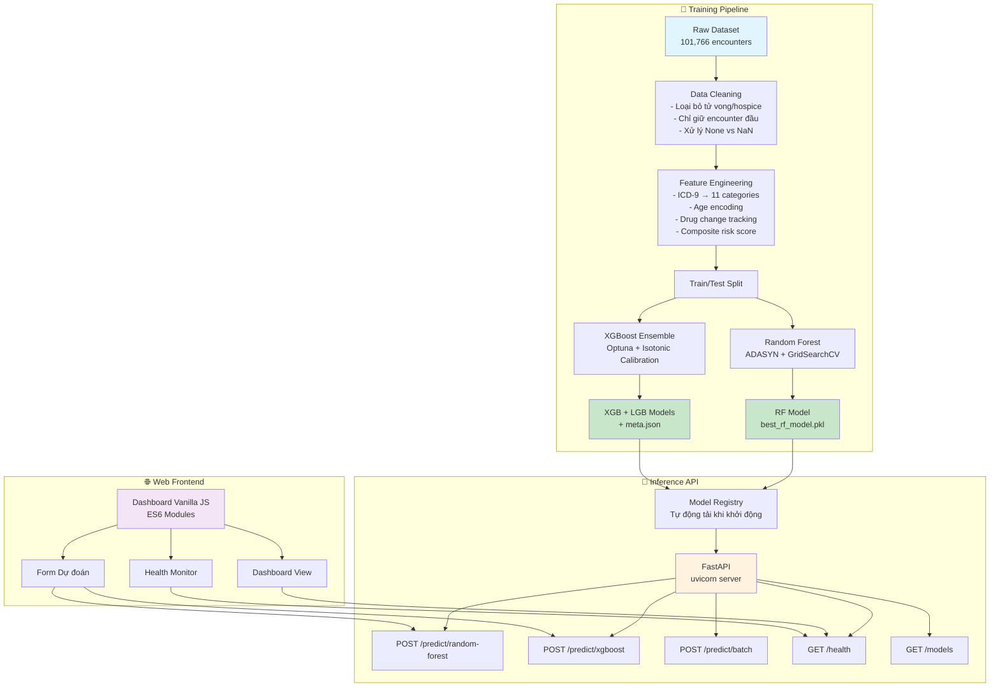
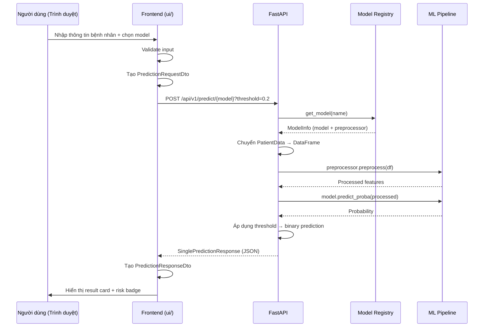

# 🏥 Hệ thống Dự đoán Tái nhập viện

> **Hệ thống ML sẵn sàng production** dự đoán nguy cơ tái nhập viện 30 ngày bằng **Random Forest** và **XGBoost + LightGBM Ensemble**, đóng gói trong **FastAPI** REST API với **dashboard JavaScript thuần**.

[](https://python.org)
[](https://fastapi.tiangolo.com)
[](https://xgboost.readthedocs.io)
[](https://lightgbm.readthedocs.io)
[](https://docker.com)

---

## 📋 Bài toán

Mỗi năm, **~20% bệnh nhân Medicare** tái nhập viện trong vòng 30 ngày sau xuất viện, gây thiệt hại **hơn 26 tỷ USD** cho hệ thống y tế Hoa Kỳ. Hệ thống này dự đoán bệnh nhân nào có nguy cơ tái nhập viện cao, giúp can thiệp sớm và giảm chi phí.

**Mục tiêu:** Phân loại nhị phân — từ 47 đặc trưng bệnh nhân tại thời điểm xuất viện, dự đoán bệnh nhân có tái nhập viện trong 30 ngày hay không.

---

## ✨ Tính năng

### 🧠 Machine Learning
- **Random Forest** classifier với ADASYN balancing và GridSearchCV hyperparameter tuning
- **XGBoost + LightGBM Ensemble** với isotonic calibration và Optuna hyperparameter optimization
- **Feature engineering** — ICD-9 code gom nhóm thành 11 categories lâm sàng, drug change tracking, composite risk scoring
- **Hai pipeline tiền xử lý độc lập** — feature alignment và encoding riêng cho từng model
- **Custom threshold** cho mỗi request dự đoán
- **F2-optimal threshold** từ dữ liệu validation (ưu tiên recall cho bối cảnh y tế)
- **Batch prediction** — lên đến 1000 bệnh nhân trong một request

### ⚙️ Backend
- **FastAPI** với Pydantic v2 request/response validation
- **Model Registry** — tự động tải tất cả model khi khởi động với dependency injection
- **Request logging middleware** — request ID, timing, structured logging tự động
- **Global exception handling** với error response chuẩn hóa
- **CORS enabled** cho frontend truy cập cross-origin
- **OpenAPI / Swagger / ReDoc** tài liệu tự động sinh
- **Docker support** với slim Python 3.11 image

### 🖥️ Frontend (`/ui`)
- **Vanilla JavaScript** (ES6 modules) — không framework
- **Kiến trúc phân lớp** — API / DTO / Model / Service / View / Component / Utils
- Chọn model — Random Forest hoặc XGBoost Ensemble
- Custom threshold với preset buttons (0.2, 0.3, 0.5, 0.7, 0.8)
- Validation form phía client
- Health monitoring real-time với auto-refresh
- Toast notification và loading spinner
- Nút khởi chạy Swagger UI
- Responsive — mobile, tablet, desktop
- Giao diện tiếng Việt
- Debug logging ở chế độ development

---

## 🏗️ Kiến trúc hệ thống



### Luồng dữ liệu



---

## 🛠️ Công nghệ sử dụng

| Layer | Công nghệ |
|-------|-----------|
| **Runtime** | Python 3.11+ |
| **Web Framework** | FastAPI 0.110+ với Uvicorn |
| **Validation** | Pydantic v2 + pydantic-settings |
| **ML — Random Forest** | scikit-learn 1.3+ (`RandomForestClassifier`) |
| **ML — XGBoost** | XGBoost 2.0+ (native categorical support) |
| **ML — LightGBM** | LightGBM 4.0+ |
| **Model Serialization** | joblib, pickle, JSON |
| **Frontend** | HTML5, CSS3, Vanilla JS (ES6 modules) |
| **Containerization** | Docker (python:3.11-slim) |
| **Logging** | Python logging với structured format |

---

## 📊 Chi tiết Pipeline ML

### Random Forest

| Thuộc tính | Giá trị |
|------------|---------|
| **Thuật toán** | `sklearn.ensemble.RandomForestClassifier` |
| **Cân bằng** | ADASYN (adaptive synthetic sampling) |
| **Tuning** | GridSearchCV với cross-validation |
| **Tiền xử lý** | One-hot encoding, `age → age_encoded`, `payer_code`/`medical_specialty`/`race` điền "Missing"/"Unknown" |
| **Threshold mặc định** | 0.2 (tối ưu recall) |
| **Feature Alignment** | Căn chỉnh về cột training, bỏ cột thừa, điền thiếu bằng 0 |

### XGBoost Ensemble

| Thuộc tính | Giá trị |
|------------|---------|
| **Thuật toán** | `CalibratedClassifierCV(XGBoost)` + `CalibratedClassifierCV(LightGBM)` |
| **Calibration** | Isotonic (hiệu chỉnh xác suất) |
| **Tuning** | Optuna với 100+ trials |
| **Trọng số Ensemble** | ~0.95 (XGBoost) + ~0.05 (LightGBM) — học từ validation |
| **Threshold mặc định** | F2-optimal threshold (~0.094) |
| **Tiền xử lý** | Native categorical support (`enable_categorical=True`), feature engineering (ICD-9 grouping, drug change tracking, composite risk score) |
| **Schema** | File JSON với dtype specification từng cột |

### Feature Engineering (`features.py`)

- **ICD-9 → Clinical Category** — 1000+ mã ICD-9 mapping thành 11 nhóm (Diabetes, Circulatory, Respiratory, Digestive, v.v.)
- **Age encoding** — Khoảng `[0-10)` → `[90-100)` mã hóa thành midpoint số
- **Discharge disposition** — Gom nhóm: Home, Transfer_SNF, Hospice_Expired, AMA, Other
- **Admission type** — Mapping: Emergency, Urgent, Elective, Newborn, v.v.
- **Admission source** — Physician_Referral, Transfer_Hospital, Emergency_Room, Court_Law, Other
- **Drug tracking** — 23 loại thuốc tiểu đường theo dõi thay đổi (Up/Down/Steady/No)
- **Composite risk score** — Tổ hợp weighted: inpatient visits, time in hospital, medication changes, emergency visits, A1C abnormality
- **Derived features**: `total_past_visits`, `log_inpatient`, `treatment_complexity`, `lab_to_days_ratio`, `num_med_changes`, `num_active_meds`, `insulin_used`, `A1C_abnormal`, `glu_abnormal`, `primary_diag_is_diabetes`

---

## 📡 API Reference

### Base URL

```
http://localhost:8000/api/v1
```

### Endpoints

| Method | Endpoint | Mô tả |
|--------|----------|-------|
| `GET` | `/health` | Health check — trả về status, version, loaded models, uptime |
| `GET` | `/version` | Thông tin phiên bản API |
| `GET` | `/models` | Danh sách tất cả model đã tải kèm metadata |
| `GET` | `/models/{name}` | Metadata của model cụ thể |
| `POST` | `/predict/random-forest` | Dự đoán đơn — Random Forest |
| `POST` | `/predict/xgboost` | Dự đoán đơn — XGBoost Ensemble |
| `POST` | `/predict/ensemble` | Ensemble trung bình của cả hai model |
| `POST` | `/predict/batch?model=xgboost` | Dự đoán hàng loạt (tối đa 1000 bệnh nhân) |

### Query Parameters

| Parameter | Kiểu | Mặc định | Mô tả |
|-----------|------|----------|-------|
| `threshold` | float (0.0–1.0) | Model default | Ngưỡng phân loại tuỳ chỉnh |

### Request Schema (Dự đoán đơn)

```json
{
  "race": "Caucasian",
  "gender": "Male",
  "age": "[70-80)",
  "admission_type_id": 1,
  "discharge_disposition_id": 1,
  "admission_source_id": 7,
  "time_in_hospital": 5,
  "payer_code": "MC",
  "medical_specialty": "InternalMedicine",
  "num_lab_procedures": 41,
  "num_procedures": 0,
  "num_medications": 16,
  "number_outpatient": 0,
  "number_emergency": 0,
  "number_inpatient": 1,
  "number_diagnoses": 5,
  "max_glu_serum": "None",
  "A1Cresult": ">7",
  "metformin": "Steady",
  "repaglinide": "No",
  "nateglinide": "No",
  "chlorpropamide": "No",
  "glimepiride": "No",
  "acetohexamide": "No",
  "glipizide": "No",
  "glyburide": "No",
  "tolbutamide": "No",
  "pioglitazone": "No",
  "rosiglitazone": "No",
  "acarbose": "No",
  "miglitol": "No",
  "troglitazone": "No",
  "tolazamide": "No",
  "examide": "No",
  "citoglipton": "No",
  "insulin": "Up",
  "glyburide-metformin": "No",
  "glipizide-metformin": "No",
  "glimepiride-pioglitazone": "No",
  "metformin-rosiglitazone": "No",
  "metformin-pioglitazone": "No",
  "change": "Ch",
  "diabetesMed": "Yes",
  "diag_1": "428",
  "diag_2": "250",
  "diag_3": "276"
}
```

### Response Schema

```json
{
  "prediction": 1,
  "probability": 0.928715,
  "model_name": "XGBoost Ensemble",
  "model_version": "3.0",
  "threshold": 0.0943,
  "timestamp": "2026-05-27T14:00:00.123456+00:00",
  "status": "success",
  "processing_time_ms": 67.89
}
```

### Tài liệu tương tác

- **Swagger UI**: [`http://localhost:8000/docs`](http://localhost:8000/docs)
- **ReDoc**: [`http://localhost:8000/redoc`](http://localhost:8000/redoc)
- **OpenAPI JSON**: [`http://localhost:8000/openapi.json`](http://localhost:8000/openapi.json)

---

## 🖥️ Dashboard Frontend

Nằm trong thư mục [`/ui`](ui/) — dashboard web hoàn chỉnh xây bằng **vanilla HTML, CSS và JavaScript (ES6 modules)**.

### Các trang

| Trang | Route | Mô tả |
|-------|-------|-------|
| **Tổng quan** | `/` | Thông tin hệ thống — trạng thái API, model đã tải, uptime, thao tác nhanh |
| **Dự đoán** | `/predict` | Form nhập liệu bệnh nhân + chọn model + threshold + kết quả |
| **Sức khỏe hệ thống** | `/health` | Giám sát health API real-time, model registry |

### Các lớp kiến trúc

```
ui/assets/js/
├── api/           HTTP client (HttpClient), API theo từng endpoint
├── dto/           Data Transfer Objects (mapping request/response)
├── models/        Domain models (PatientModel, PredictionModel)
├── services/      Logic nghiệp vụ (predictionService, healthService)
├── views/         Page controllers (dashboard, prediction, health)
├── components/    UI tái sử dụng (navbar, sidebar, form, result, loading, toast)
└── utils/         Constants, validators, formatters, helpers
```

### Chạy frontend

```bash
cd ui

# Python
python -m http.server 5500

# VS Code: Chuột phải index.html → Open with Live Server

# Node
npx serve .
```

Mở `http://localhost:5500` — frontend tự động kết nối đến `http://localhost:8000`.

---

## 🚀 Bắt đầu nhanh

### Yêu cầu

- Python 3.11+
- File model đã huấn luyện tại đường dẫn mong đợi (xem [Model Paths](#-cấu-hình))

### Cài đặt backend

```bash
# Clone
cd patient-readmission-prediction-core

# Môi trường ảo
python -m venv venv
source venv/bin/activate    # Linux/Mac
# venv\Scripts\activate     # Windows

# Cài đặt
pip install -r requirements.txt

# Cấu hình (tuỳ chọn)
cp .env.example .env
# Sửa .env nếu đường dẫn model khác

# Khởi động
uvicorn app.main:app --host 0.0.0.0 --port 8000 --reload
```

### Kiểm tra

```bash
# Health check
curl http://localhost:8000/api/v1/health

# Dự đoán
curl -X POST http://localhost:8000/api/v1/predict/xgboost \
  -H "Content-Type: application/json" \
  -d @examples/predict_payload.json
```

### Docker

```bash
docker build -t readmission-api -f app/Dockerfile .
docker run -p 8000:8000 readmission-api
```

---

## 📁 Cấu trúc dự án

```
├── app/                          # Backend (FastAPI)
│   ├── api/v1/                   # API routes
│   │   ├── predict.py            # Endpoint dự đoán
│   │   ├── health.py             # Health & version
│   │   └── metadata.py           # Model metadata
│   ├── core/                     # Cấu hình core
│   │   ├── config.py             # Pydantic settings (env vars)
│   │   ├── dependencies.py       # FastAPI DI
│   │   ├── exceptions.py         # Custom exceptions
│   │   └── logging_.py           # Logging setup
│   ├── middleware/                # HTTP middleware
│   │   └── logging_middleware.py # Request ID + timing
│   ├── ml/                       # ML logic
│   │   ├── features.py           # Feature engineering
│   │   ├── loader.py             # Model I/O
│   │   └── preprocessing.py      # Tiền xử lý theo model
│   ├── models/                   # Model registry
│   │   └── registry.py           # Tự động tải khi khởi động
│   ├── schemas/                  # Pydantic models
│   │   ├── predict.py            # Prediction I/O
│   │   ├── health.py             # Health response
│   │   └── metadata.py           # Model metadata
│   ├── services/                 # Logic nghiệp vụ
│   │   └── prediction.py         # Điều phối dự đoán
│   ├── main.py                   # Điểm vào ứng dụng
│   ├── Dockerfile                # Container build
│   └── requirements.txt          # Python deps
│
├── ui/                           # Frontend (vanilla JS)
│   ├── index.html                # Điểm vào
│   ├── assets/
│   │   ├── css/                  # 5 stylesheets
│   │   └── js/                   # 26 JS modules
│   ├── docs/                     # Tài liệu frontend (tiếng Việt)
│   └── README.md                 # Tài liệu frontend
│
├── RandomForest/                 # RF model artifacts
│   └── readmission_rf/outputs/
│       └── best_rf_model.pkl
│
├── xgBoost/                      # XGBoost model artifacts
│   └── models/
│       ├── calibrated_xgb_v3.joblib
│       ├── calibrated_lgb_v3.joblib
│       ├── ensemble_meta_v3.json
│       └── model_schema_v3.json
│
├── examples/                     # Ví dụ sử dụng API
│   ├── predict_payload.json
│   ├── batch_payload.json
│   └── curl_commands.sh
│
├── .env.example                  # Mẫu biến môi trường
├── requirements.txt              # Dependencies chính
├── KPDL.txt                      # Kiến thức miền (tiếng Việt)
└── README.md                     # File này
```

---

## ⚙️ Cấu hình

Tất cả cài đặt qua file `.env` (copy từ `.env.example`):

| Biến | Mặc định | Mô tả |
|------|----------|-------|
| `PROJECT_NAME` | `Hospital Readmission Prediction API` | Tiêu đề API |
| `PROJECT_VERSION` | `1.0.0` | Phiên bản API |
| `API_V1_PREFIX` | `/api/v1` | Base path |
| `DEBUG` | `false` | Chế độ debug |
| `LOG_LEVEL` | `INFO` | Cấp độ logging |
| `CORS_ORIGINS` | `["*"]` | CORS origins được phép |
| `RANDOM_FOREST_MODEL_PATH` | `RandomForest/.../best_rf_model.pkl` | File RF model |
| `XGBOOST_MODEL_PATH` | `xgBoost/models/calibrated_xgb_v3.joblib` | Model XGBoost |
| `XGBOOST_LGBM_MODEL_PATH` | `xgBoost/models/calibrated_lgb_v3.joblib` | Model LightGBM |
| `XGBOOST_ENSEMBLE_META_PATH` | `xgBoost/models/ensemble_meta_v3.json` | Trọng số ensemble |
| `XGBOOST_SCHEMA_PATH` | `xgBoost/models/model_schema_v3.json` | Schema đặc trưng |

---

## 🧪 Kiểm thử API với cURL

```bash
# Health
curl -s http://localhost:8000/api/v1/health | jq .

# Random Forest
curl -s -X POST http://localhost:8000/api/v1/predict/random-forest \
  -H "Content-Type: application/json" \
  -d @examples/predict_payload.json | jq .

# XGBoost với custom threshold
curl -s -X POST "http://localhost:8000/api/v1/predict/xgboost?threshold=0.3" \
  -H "Content-Type: application/json" \
  -d @examples/predict_payload.json | jq .

# Batch (tối đa 1000 bệnh nhân)
curl -s -X POST "http://localhost:8000/api/v1/predict/batch?model=xgboost" \
  -H "Content-Type: application/json" \
  -d @examples/batch_payload.json | jq .
```

---

## 🧹 Ghi chú miền dữ liệu

Dựa trên phân tích dataset y tế (`KPDL.txt`):

- **Target**: Nhị phân — tái nhập viện `<30` ngày → `1`, còn lại → `0`
- **Làm sạch dữ liệu**: Loại bỏ bệnh nhân tử vong/hospice (discharge disposition IDs 11, 13, 14, 19, 20, 21)
- **`"None"` là tín hiệu y tế**: Trong `A1Cresult` và `max_glu_serum`, "None" nghĩa là xét nghiệm **không được bác sĩ chỉ định** — có ý nghĩa lâm sàng, KHÔNG phải dữ liệu thiếu
- **Giá trị thiếu thật sự** được mã hóa là `?` trong dataset gốc
- **Mất cân bằng lớp**: Xử lý ở cấp thuật toán (`class_weight='balanced'`, `scale_pos_weight`), KHÔNG dùng SMOTE/ADASYN trên toàn bộ dữ liệu sau khi chia train/test

---

## 🤝 Đóng góp

1. Fork repository
2. Tạo branch tính năng (`git checkout -b feature/amazing-feature`)
3. Commit thay đổi (`git commit -m 'Add amazing feature'`)
4. Push (`git push origin feature/amazing-feature`)
5. Mở Pull Request

---

## 📄 Giấy phép

MIT License — xem file [LICENSE](LICENSE) để biết chi tiết.

---

## 🙏 Lời cảm ơn

- [UCI ML Repository](https://archive.ics.uci.edu/ml/datasets/Diabetes+130-US+hospitals+for+years+1999-2008) — Bộ dữ liệu Diabetes 130-US Hospitals
- [scikit-learn](https://scikit-learn.org/), [XGBoost](https://xgboost.readthedocs.io/), [LightGBM](https://lightgbm.readthedocs.io/) communities
- [FastAPI](https://fastapi.tiangolo.com/) — Web framework Python hiện đại
