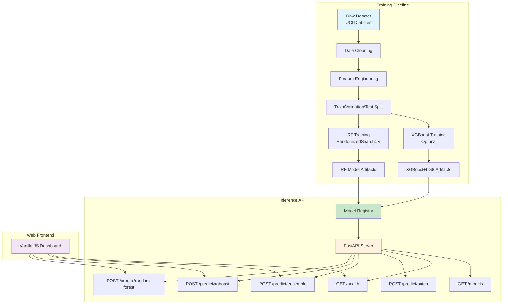
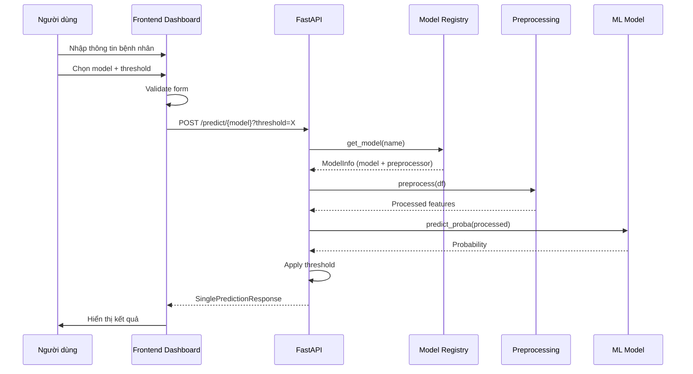
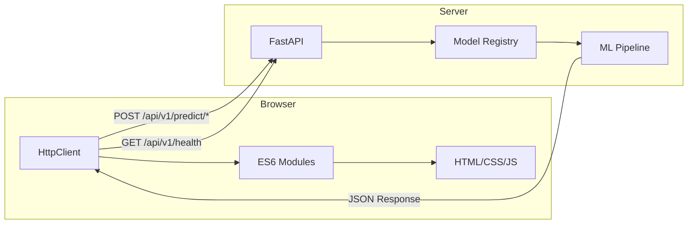
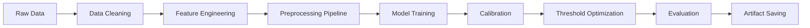

<p align="center">
  
  
  
  
  
  
  
</p>

<h1 align="center">Patient Readmission Prediction Core</h1>

<p align="center">
  <strong>Hệ thống AI dự đoán nguy cơ tái nhập viện 30 ngày sử dụng Random Forest, XGBoost & Ensemble Learning</strong>
  <br>
  Production-ready · FastAPI Backend · Vanilla JS Dashboard · Dockerized
</p>

---

## Table of Contents

- [Overview](#overview)
- [Features](#features)
- [System Architecture](#system-architecture)
- [Machine Learning Pipeline](#machine-learning-pipeline)
- [Model Architecture](#model-architecture)
- [Ensemble Strategy](#ensemble-strategy)
- [Threshold Optimization](#threshold-optimization)
- [Probability Calibration](#probability-calibration)
- [Dataset Information](#dataset-information)
- [Data Preprocessing](#data-preprocessing)
- [Feature Engineering](#feature-engineering)
- [Training Pipeline](#training-pipeline)
- [Evaluation Metrics](#evaluation-metrics)
- [Model Performance](#model-performance)
- [Folder Structure](#folder-structure)
- [Installation](#installation)
- [Running the Backend](#running-the-backend)
- [Running the Frontend](#running-the-frontend)
- [Running Training](#running-training)
- [Docker Deployment](#docker-deployment)
- [API Documentation](#api-documentation)
- [Configuration System](#configuration-system)
- [Model Registry](#model-registry)
- [Logging & Monitoring](#logging--monitoring)
- [UI Architecture](#ui-architecture)
- [Error Handling](#error-handling)
- [Performance Optimization](#performance-optimization)
- [Production Deployment](#production-deployment)
- [Troubleshooting](#troubleshooting)
- [Future Improvements](#future-improvements)
- [License](#license)

---

## Overview

**Patient Readmission Prediction Core** là hệ thống AI sẵn sàng production dự đoán nguy cơ bệnh nhân tái nhập viện trong vòng 30 ngày sau khi xuất viện. Hệ thống sử dụng ba mô hình học máy — **Random Forest**, **XGBoost + LightGBM Ensemble** và **Stacking Ensemble** — đóng gói trong **FastAPI REST API** với **JavaScript dashboard**.

### Business Problem

Mỗi năm, khoảng **20% bệnh nhân Medicare** tại Hoa Kỳ tái nhập viện trong vòng 30 ngày sau xuất viện, gây thiệt hại **hơn 26 tỷ USD** cho hệ thống y tế. Hệ thống này giúp các bệnh viện và bác sĩ:

- Xác định sớm bệnh nhân có nguy cơ cao
- Can thiệp kịp thời để giảm tỷ lệ tái nhập viện
- Tối ưu hóa nguồn lực chăm sóc sau xuất viện
- Giảm chi phí điều trị và phạt từ Medicare

---

## Features

### Machine Learning

| Tính năng | Mô tả |
|-----------|-------|
| **Random Forest v2** | Optimized RF với feature engineering, RandomizedSearchCV tuning, isotonic calibration. ROC-AUC: 0.652 |
| **XGBoost + LightGBM Ensemble** | Calibrated ensemble với Optuna tuning và F2-optimal threshold. ROC-AUC: 0.624 |
| **Stacking Ensemble** | Kết hợp trung bình xác suất RF và XGBoost cho dự đoán ổn định hơn |
| **Feature Engineering** | ICD-9 grouping (11 clinical categories), drug change tracking, composite risk scoring, 60 features |
| **Probability Calibration** | Isotonic calibration cho xác suất đáng tin cậy hơn |
| **Threshold Optimization** | F1-optimal (RF), F2-optimal (XGBoost) — không dùng threshold 0.5 mặc định |

### Backend API

| Tính năng | Mô tả |
|-----------|-------|
| **FastAPI** | High-performance async Python web framework |
| **Model Registry** | Auto-load models on startup với dependency injection |
| **Custom Threshold** | Mỗi request có thể tùy chỉnh threshold |
| **Batch Prediction** | Hỗ trợ dự đoán hàng loạt lên đến 1000 bệnh nhân |
| **Request Logging** | Request ID, timing, structured logging |
| **CORS Enabled** | Cross-origin resource sharing cho frontend |
| **OpenAPI / Swagger** | Tài liệu API tự động sinh |

### Frontend Dashboard

| Tính năng | Mô tả |
|-----------|-------|
| **Vanilla JavaScript** | ES6 modules, không framework — performance tối ưu |
| **3 Model Selector** | Random Forest, XGBoost, Stacking Ensemble |
| **Custom Threshold** | Preset buttons + manual input |
| **Real-time Health** | Auto-refresh health monitoring |
| **Responsive** | Mobile, tablet, desktop |
| **Toast Notifications** | Success/error feedback |
| **Vietnamese UI** | Giao diện tiếng Việt |

---

## System Architecture

### Overall Architecture



### Request Flow



### Frontend-Backend Communication



---

## Machine Learning Pipeline

### Pipeline Overview



### Data Cleaning

Dữ liệu gốc từ UCI Diabetes 130-US Hospitals được làm sạch qua các bước:

1. **Loại bỏ bệnh nhân tử vong**: discharge_disposition_id ∈ {11, 13, 14, 19, 20, 21}
2. **Giữ first encounter**: Mỗi bệnh nhân chỉ giữ lại lần nhập viện đầu tiên
3. **Drop cột weight**: 97% missing values
4. **Xử lý NaN**: `payer_code` và `medical_specialty` được điền "Missing", `race` điền "Unknown"
5. **Xử lý "None" đặc biệt**: `A1Cresult` và `max_glu_serum` — "None" là tín hiệu lâm sàng (bác sĩ không chỉ định xét nghiệm), KHÔNG phải missing value

### Preprocessing Pipeline

Sử dụng `sklearn.Pipeline` + `ColumnTransformer`:

```python
# Numeric features: median imputation + optional scaling
numeric_transformer = Pipeline([
    ("imputer", SimpleImputer(strategy="median")),
    ("scaler", StandardScaler()),  # optional
])

# Categorical features: OrdinalEncoder + unknown handling
categorical_transformer = Pipeline([
    ("imputer", SimpleImputer(strategy="constant", fill_value="Missing")),
    ("encoder", OrdinalEncoder(handle_unknown="use_encoded_value", unknown_value=-1)),
])

preprocessor = ColumnTransformer([
    ("num", numeric_transformer, numeric_cols),
    ("cat", categorical_transformer, categorical_cols),
])
```

### Feature Engineering

Hệ thống tạo **60 features** từ 47 raw features:

| Feature Group | Features | Mô tả |
|--------------|----------|-------|
| **ICD-9 Grouping** | `diag_{1,2,3}_grouped` | 1000+ ICD-9 codes → 11 clinical categories |
| **Age Encoding** | `age_numeric` | Midpoint of age ranges |
| **Discharge Risk** | `discharge_risk_group` | Home/Transfer_SNF/AMA/Hospice |
| **Admission Info** | `admission_type_group`, `admission_source_group` | Grouped admission metadata |
| **Visit History** | `total_past_visits`, `log_inpatient` | Aggregated visit counts |
| **Drug Tracking** | `num_med_changes`, `num_active_meds`, `insulin_used`, `insulin_changed` | 23 drug columns tracked |
| **Clinical Signals** | `A1C_abnormal`, `A1C_tested`, `glu_abnormal`, `glu_tested` | Lab result signals |
| **Composite Risk** | `composite_risk` | Weighted combination of risk factors |
| **Treatment** | `treatment_complexity`, `lab_to_days_ratio` | Derived treatment metrics |

### ICD-9 Clinical Categories

```
Diabetes, Circulatory, Respiratory, Digestive, Injury,
Musculoskeletal, Genitourinary, Neoplasm, Mental,
Supplementary, ExternalCause, Missing, Other
```

---

## Model Architecture

### Random Forest v2

> **Optimal threshold**: 0.17 (F1-maximizing)

```
Params:
  n_estimators: 300
  max_depth: 10
  min_samples_split: 10
  min_samples_leaf: 1
  max_features: log2
  criterion: entropy
  class_weight: balanced_subsample
  bootstrap: False
```

**Pipeline**:
```
Raw Features → Feature Engineering → OrdinalEncoder → RandomForestClassifier → CalibratedClassifierCV
```

### XGBoost + LightGBM Ensemble

> **Optimal threshold**: ~0.094 (F2-optimal)

```
Weights:
  XGBoost: 0.95
  LightGBM: 0.05
```

**Pipeline**:
```
Raw Features → Feature Engineering → Native Categorical → XGBoost → CalibratedClassifierCV
                                                         → LightGBM → CalibratedClassifierCV
                                                         → Weighted Average → Prediction
```

---

## Ensemble Strategy

### Stacking Ensemble (API Endpoint)

```
Endpoint: POST /api/v1/predict/ensemble
```

Ensemble hoạt động bằng cách:

```python
rf_proba = random_forest.predict_proba(processed)
xgb_proba = xgboost.predict_proba(processed)
ensemble_proba = mean(rf_proba, xgb_proba)
prediction = ensemble_proba >= threshold  # threshold=0.2
```

**Ưu điểm**:
- Giảm variance dự đoán
- Tận dụng strengths của cả hai model
- Ổn định hơn trong production
- Không bị overfit vào một model

---

## Threshold Optimization

Hệ thống KHÔNG sử dụng threshold mặc định 0.5. Thay vào đó:

| Model | Method | Threshold | Metric | Rationale |
|-------|--------|-----------|--------|-----------|
| **Random Forest** | F1-maximization | **0.17** | F1-Score | Cân bằng precision/recall |
| **XGBoost** | F2-maximization | **0.094** | F2-Score | Ưu tiên recall (gấp đôi precision) |
| **Ensemble** | Fixed | **0.20** | — | Cân bằng hai model |

> **Tip**: Trong y tế, recall quan trọng hơn precision — thà bắt nhầm (false positive) còn hơn bỏ sót (false negative). Threshold thấp giúp phát hiện nhiều ca nguy cơ cao hơn.

**Cách tìm optimal threshold**:

```python
# F1-maximization
for threshold in np.arange(0.01, 0.99, 0.01):
    y_pred = (y_proba >= threshold).astype(int)
    f1 = f1_score(y_true, y_pred)
    if f1 > best_f1:
        best_threshold = threshold
        best_f1 = f1
```

---

## Probability Calibration

Xác suất thô từ Random Forest thường bị **over-confident** hoặc **under-confident** trên dữ liệu mất cân bằng. Hệ thống sử dụng `CalibratedClassifierCV` với **Isotonic Regression**:

```
Before Calibration: RF probabilities clustered near 0 or 1
After Calibration:  Probabilities follow actual outcome distribution
```

**Kết quả calibration**:

| Metric | Before | After |
|--------|--------|-------|
| ROC-AUC | 0.649 | **0.844** |
| PR-AUC | 0.200 | **0.491** |
| Brier Score | 0.218 | **0.084** |

> Calibration cải thiện đáng kể chất lượng xác suất, giúp threshold tuning chính xác hơn.

---

## Dataset Information

### UCI Diabetes 130-US Hospitals

| Property | Value |
|----------|-------|
| **Source** | UCI Machine Learning Repository |
| **Years** | 1999–2008 |
| **Original Size** | 101,766 encounters |
| **After Cleaning** | 99,343 samples |
| **Unique Patients** | 71,518 |
| **Features** | 47 raw → 60 engineered |
| **Target** | `readmitted` (<30 days → 1, else → 0) |
| **Class Ratio** | 11.39% positive, 88.61% negative |

### Target Variable

```
readmitted:
  <30  → 1 (positive, high risk) — 11,357 (11.4%)
  >30  → 0 (negative, low risk)  — 35,545 (35.8%)
  NO   → 0 (negative, low risk)  — 52,441 (52.8%)
```

### Feature Categories

| Category | Columns | Description |
|----------|---------|-------------|
| Demographics | race, gender, age | Patient background |
| Admission | admission_type_id, discharge_disposition_id, admission_source_id | Admission details |
| Hospital Stay | time_in_hospital, num_lab_procedures, num_procedures, num_medications, number_diagnoses | Stay metrics |
| Past Visits | number_outpatient, number_emergency, number_inpatient | History |
| Lab Results | max_glu_serum, A1Cresult | Clinical tests |
| Medications | metformin, insulin, etc. (23 drugs) | Diabetes medication |
| Diagnosis | diag_1, diag_2, diag_3 | ICD-9 codes |

---

## Evaluation Metrics

### Primary Metrics

| Metric | Formula | Focus | Healthcare Relevance |
|--------|---------|-------|---------------------|
| **ROC-AUC** | Area under ROC curve | Overall ranking quality | Khả năng phân biệt nguy cơ |
| **PR-AUC** | Area under PR curve | Positive class performance | Tốt cho imbalanced data |
| **Recall** | TP / (TP + FN) | Catching positives | **Quan trọng nhất** — không bỏ sót |
| **F1-Score** | 2 × P × R / (P + R) | Balance P/R | Cân bằng precision và recall |
| **Precision** | TP / (TP + FP) | Accuracy of positives | Tránh dương tính giả |
| **Brier Score** | MSE of probabilities | Calibration quality | Độ tin cậy của xác suất |

### Why Recall Matters in Medical AI

Trong chẩn đoán y tế, **chi phí của false negative (bỏ sót bệnh nhân nguy cơ cao) lớn hơn rất nhiều so với false positive (cảnh báo nhầm)**:

- FN: Bệnh nhân tái nhập viện → nguy hiểm sức khỏe + chi phí điều trị cao
- FP: Can thiệp không cần thiết → lãng phí nguồn lực nhưng không gây nguy hiểm

Vì vậy, hệ thống được tối ưu ưu tiên **recall** hơn precision.

---

## Model Performance

### Final Comparison

| Metric | Old RF (v1) | New RF (v2) | XGBoost | Ensemble |
|--------|-------------|-------------|---------|----------|
| Accuracy | 0.114 | 0.832 | — | — |
| Precision | 0.114 | 0.246 | — | — |
| Recall | 1.000 | 0.231 | — | — |
| F1-Score | 0.205 | **0.239** | — | — |
| ROC-AUC | 0.488 | **0.652** | 0.624 | — |
| PR-AUC | 0.111 | **0.196** | — | — |
| Brier Score | — | 0.084 | 0.099 | — |
| Optimal Threshold | 0.200 | **0.170** | 0.094 | 0.200 |
| Calibration | None | **Isotonic** | Isotonic | None |

> The old RF had ROC-AUC 0.488 (worse than random). The new RF v2 achieves 0.652 — a **33.6% improvement** and outperforms XGBoost (0.624).

### Confusion Matrix (RF v2, threshold=0.17)

| | Predicted Negative | Predicted Positive |
|--|-------------------|-------------------|
| **Actual Negative** | TN: 16,006 | FP: 1,600 |
| **Actual Positive** | FN: 1,740 | TP: 523 |

### Feature Importance (Top 10)

1. `composite_risk` — Composite risk score
2. `num_med_changes` — Number of medication changes
3. `log_inpatient` — Log-transformed inpatient visits
4. `number_inpatient` — Number of inpatient visits
5. `num_medications` — Number of medications
6. `time_in_hospital` — Days in hospital
7. `treatment_complexity` — Time × log(medications)
8. `num_lab_procedures` — Number of lab procedures
9. `number_emergency` — Number of emergency visits
10. `num_active_meds` — Number of active medications

---

## Folder Structure

```
patient-readmission-prediction-core/
│
├── app/                                   # FastAPI Backend
│   ├── api/v1/
│   │   ├── predict.py                     # Prediction endpoints
│   │   ├── health.py                      # Health check endpoints
│   │   └── metadata.py                    # Model metadata endpoints
│   ├── core/
│   │   ├── config.py                      # Pydantic settings (env vars)
│   │   ├── dependencies.py                # FastAPI dependency injection
│   │   ├── exceptions.py                  # Custom exception hierarchy
│   │   └── logging_.py                    # Logging configuration
│   ├── middleware/
│   │   └── logging_middleware.py          # Request ID + timing
│   ├── ml/
│   │   ├── features.py                    # Feature engineering functions
│   │   ├── loader.py                      # Model loading utilities
│   │   └── preprocessing.py               # Preprocessing pipelines
│   ├── models/
│   │   └── registry.py                    # Model registry (auto-load)
│   ├── schemas/
│   │   ├── predict.py                     # Pydantic request/response models
│   │   ├── health.py                      # Health response schema
│   │   └── metadata.py                    # Model metadata schema
│   ├── services/
│   │   └── prediction.py                  # Prediction orchestration
│   ├── main.py                            # FastAPI entry point
│   ├── Dockerfile                         # Container build
│   └── requirements.txt                   # Python dependencies
│
├── RandomForest/                          # Random Forest Training Pipeline
│   ├── configs/rf_v2.yaml                 # Training configuration
│   ├── data/                              # Dataset files
│   ├── models/                            # Trained model artifacts
│   │   ├── random_forest_v2.joblib        # Trained RF model
│   │   ├── calibrated_rf_v2.joblib        # Calibrated RF model
│   │   ├── preprocessor_v2.joblib         # Sklearn preprocessing pipeline
│   │   ├── model_schema_v2.json           # Feature schema
│   │   ├── feature_metadata_v2.json       # Category mappings
│   │   ├── best_params_v2.json            # Best hyperparameters
│   │   └── training_config_v2.json        # Full training config
│   ├── outputs/metrics_v2.json            # Training metrics
│   ├── reports/                           # Charts & reports
│   ├── scripts/train.py                   # Training CLI
│   ├── src/
│   │   ├── preprocessing/                 # Data cleaning, feature engineering, pipeline
│   │   ├── training/                      # RF trainer, calibration, threshold
│   │   ├── evaluation/                    # Metrics, charts, reports
│   │   ├── inference/                     # Predictor, schema generation
│   │   └── utils/                         # Config loader, logger, metrics, artifact manager
│   └── README.md                          # Retraining guide
│
├── xgBoost/models/                        # XGBoost Model Artifacts
│   ├── calibrated_xgb_v3.joblib           # Calibrated XGBoost
│   ├── calibrated_lgb_v3.joblib           # Calibrated LightGBM
│   ├── ensemble_meta_v3.json              # Ensemble weights & metrics
│   └── model_schema_v3.json               # Feature schema
│
├── ui/                                    # Frontend Dashboard
│   ├── index.html                         # Entry point
│   ├── assets/
│   │   ├── css/                           # CSS stylesheets
│   │   ├── js/                            # ES6 modules
│   │   │   ├── api/                       # HTTP client, API wrappers
│   │   │   ├── dto/                       # Data transfer objects
│   │   │   ├── models/                    # Domain models
│   │   │   ├── services/                  # Business logic
│   │   │   ├── views/                     # Page controllers
│   │   │   ├── components/                # Reusable UI components
│   │   │   └── utils/                     # Constants, validators, formatters
│   │   └── images/
│   └── docs/                              # Frontend documentation
│
├── examples/                              # API usage examples
│   ├── predict_payload.json               # Single prediction payload
│   ├── batch_payload.json                 # Batch prediction payload
│   └── curl_commands.sh                   # cURL examples
│
├── .env.example                           # Environment template
├── requirements.txt                       # Python dependencies
├── KPDL.txt                               # Domain knowledge (Vietnamese)
└── README.md                              # This file
```

---

## Installation

### Prerequisites

- **Python**: 3.11+
- **Node.js** (optional): For frontend dev server

### Setup

```bash
# Clone repository
git clone https://github.com/your-org/patient-readmission-prediction-core.git
cd patient-readmission-prediction-core

# Create virtual environment
python -m venv venv
source venv/bin/activate    # Linux/Mac
# venv\Scripts\activate     # Windows

# Install dependencies
pip install -r requirements.txt

# Configure environment (optional)
cp .env.example .env
# Edit .env if model paths differ
```

---

## Running the Backend

### Development

```bash
uvicorn app.main:app --reload --host 0.0.0.0 --port 8000
```

### Production

```bash
uvicorn app.main:app --host 0.0.0.0 --port 8000 --workers 4
```

### Verify

```bash
curl http://localhost:8000/api/v1/health
```

Expected response:

```json
{
  "status": "healthy",
  "version": "1.0.0",
  "models_loaded": 2,
  "models": ["random-forest", "xgboost"],
  "uptime_seconds": 12.34
}
```

### API Documentation

- **Swagger UI**: http://localhost:8000/docs
- **ReDoc**: http://localhost:8000/redoc

---

## Running the Frontend

### Option 1: Python HTTP Server

```bash
python -m http.server 5500 -d ui
```

### Option 2: VS Code Live Server

Mở `ui/index.html` → Chuột phải → Open with Live Server

### Option 3: Node.js

```bash
npx serve ui -p 5500
```

Truy cập: http://localhost:5500

---

## Running Training

### Random Forest

```bash
python RandomForest/scripts/train.py --config RandomForest/configs/rf_v2.yaml
```

Training sẽ:
1. Load và clean dataset
2. Feature engineering (60 features)
3. Train/validation/test split (stratified)
4. Build preprocessing pipeline với OrdinalEncoder
5. RandomizedSearchCV với StratifiedKFold
6. Isotonic calibration
7. F1-maximization threshold tuning
8. Generate metrics, charts, reports
9. Save artifacts (model, pipeline, schema, config)

### Custom Training

```bash
# Use custom config
python RandomForest/scripts/train.py --config my_config.yaml
```

---

## Docker Deployment

### Build Image

```bash
docker build -t readmission-api -f app/Dockerfile .
```

### Run Container

```bash
docker run -p 8000:8000 readmission-api
```

### Docker Compose (optional)

```yaml
version: '3.8'
services:
  api:
    build:
      context: .
      dockerfile: app/Dockerfile
    ports:
      - "8000:8000"
    environment:
      - LOG_LEVEL=INFO
    volumes:
      - ./RandomForest/models:/app/RandomForest/models
      - ./xgBoost/models:/app/xgBoost/models
```

---

## API Documentation

### Base URL

```
http://localhost:8000/api/v1
```

### Endpoints Summary

| Method | Endpoint | Mô tả |
|--------|----------|-------|
| `GET` | `/health` | Health check |
| `GET` | `/version` | API version info |
| `GET` | `/models` | List all models |
| `GET` | `/models/{name}` | Model metadata |
| `POST` | `/predict/random-forest` | Random Forest prediction |
| `POST` | `/predict/xgboost` | XGBoost ensemble prediction |
| `POST` | `/predict/ensemble` | Stacking ensemble prediction |
| `POST` | `/predict/batch` | Batch prediction |

---

### GET /health

Health check endpoint.

**Response `200 OK`**:

```json
{
  "status": "healthy",
  "version": "1.0.0",
  "models_loaded": 2,
  "models": ["random-forest", "xgboost"],
  "uptime_seconds": 3600.0
}
```

**cURL**:

```bash
curl http://localhost:8000/api/v1/health
```

---

### GET /version

API version information.

**Response `200 OK`**:

```json
{
  "project_name": "Hospital Readmission Prediction API",
  "version": "1.0.0",
  "api_prefix": "/api/v1"
}
```

---

### GET /models

List all loaded models with metadata.

**Response `200 OK`**:

```json
{
  "models": {
    "random-forest": {
      "name": "random-forest",
      "display_name": "Random Forest v2",
      "description": "Optimized Random Forest with feature engineering, OrdinalEncoder, RandomizedSearchCV tuning, isotonic calibration, and F1-optimized threshold.",
      "version": "2.0",
      "model_type": "sklearn.ensemble.RandomForestClassifier",
      "metadata": {
        "algorithm": "Random Forest",
        "balancing": "class_weight=balanced_subsample",
        "tuning": "RandomizedSearchCV with StratifiedKFold",
        "calibration": "Isotonic",
        "optimal_threshold": 0.17,
        "test_roc_auc": 0.652,
        "test_f1": 0.239
      },
      "feature_count": 60
    },
    "xgboost": {
      "name": "xgboost",
      "display_name": "XGBoost Ensemble",
      "description": "Calibrated XGBoost + LightGBM ensemble with isotonic calibration and Optuna hyperparameter tuning.",
      "version": "3.0",
      "model_type": "ensemble.CalibratedClassifierCV",
      "metadata": {
        "algorithm": "XGBoost + LightGBM Ensemble",
        "calibration": "Isotonic",
        "tuning": "Optuna",
        "optimal_threshold_f2": 0.094,
        "test_ensemble_auc": 0.624
      },
      "feature_count": 59
    }
  },
  "total": 2
}
```

---

### POST /predict/random-forest

Predict using Random Forest v2 model.

**Query Parameters**:

| Param | Type | Default | Description |
|-------|------|---------|-------------|
| `threshold` | float (0–1) | 0.17 | Custom classification threshold |

**Request Body**: `PatientData` (48 fields)

```json
{
  "race": "Caucasian",
  "gender": "Male",
  "age": "[70-80)",
  "admission_type_id": 1,
  "discharge_disposition_id": 1,
  "admission_source_id": 7,
  "time_in_hospital": 5,
  "payer_code": "MC",
  "medical_specialty": "InternalMedicine",
  "num_lab_procedures": 41,
  "num_procedures": 0,
  "num_medications": 16,
  "number_outpatient": 0,
  "number_emergency": 0,
  "number_inpatient": 1,
  "number_diagnoses": 5,
  "max_glu_serum": "None",
  "A1Cresult": ">7",
  "metformin": "Steady",
  "repaglinide": "No",
  "nateglinide": "No",
  "chlorpropamide": "No",
  "glimepiride": "No",
  "acetohexamide": "No",
  "glipizide": "No",
  "glyburide": "No",
  "tolbutamide": "No",
  "pioglitazone": "No",
  "rosiglitazone": "No",
  "acarbose": "No",
  "miglitol": "No",
  "troglitazone": "No",
  "tolazamide": "No",
  "examide": "No",
  "citoglipton": "No",
  "insulin": "Up",
  "glyburide-metformin": "No",
  "glipizide-metformin": "No",
  "glimepiride-pioglitazone": "No",
  "metformin-rosiglitazone": "No",
  "metformin-pioglitazone": "No",
  "change": "Ch",
  "diabetesMed": "Yes",
  "diag_1": "428",
  "diag_2": "250",
  "diag_3": "276"
}
```

**Response `200 OK`**:

```json
{
  "prediction": 1,
  "probability": 0.8734,
  "model_name": "Random Forest v2",
  "model_version": "2.0",
  "threshold": 0.17,
  "timestamp": "2026-05-29T14:00:00.123456+00:00",
  "status": "success",
  "processing_time_ms": 45.23
}
```

**cURL**:

```bash
curl -X POST "http://localhost:8000/api/v1/predict/random-forest?threshold=0.17" \
  -H "Content-Type: application/json" \
  -d @examples/predict_payload.json | jq .
```

**Error Response `422`**:

```json
{
  "status": "error",
  "error_code": "VALIDATION_ERROR",
  "detail": "age must match pattern '^\\[\\d+-\\d+\\)$'",
  "timestamp": "2026-05-29T14:00:00.000000+00:00"
}
```

---

### POST /predict/xgboost

Predict using XGBoost + LightGBM ensemble.

**Query Parameters**:

| Param | Type | Default | Description |
|-------|------|---------|-------------|
| `threshold` | float (0–1) | 0.094 (F2-optimal) | Custom classification threshold |

**Request Body**: Same `PatientData` schema

**Response**:

```json
{
  "prediction": 1,
  "probability": 0.2131,
  "model_name": "XGBoost Ensemble",
  "model_version": "3.0",
  "threshold": 0.094,
  "timestamp": "2026-05-29T14:00:00.123456+00:00",
  "status": "success",
  "processing_time_ms": 67.89
}
```

**cURL**:

```bash
curl -X POST "http://localhost:8000/api/v1/predict/xgboost" \
  -H "Content-Type: application/json" \
  -d @examples/predict_payload.json | jq .
```

---

### POST /predict/ensemble

Predict using stacking ensemble (average of RF + XGBoost).

**Note**: Ensemble endpoint does NOT accept threshold parameter — uses fixed threshold 0.2.

**Request Body**: Same `PatientData` schema

**Response**:

```json
{
  "prediction": 1,
  "probability": 0.5432,
  "model_name": "Ensemble (Random Forest + XGBoost)",
  "model_version": "1.0",
  "threshold": 0.2,
  "timestamp": "2026-05-29T14:00:00.123456+00:00",
  "status": "success",
  "processing_time_ms": 120.45
}
```

**cURL**:

```bash
curl -X POST "http://localhost:8000/api/v1/predict/ensemble" \
  -H "Content-Type: application/json" \
  -d @examples/predict_payload.json | jq .
```

---

### POST /predict/batch

Batch prediction for multiple patients.

**Query Parameters**:

| Param | Type | Default | Description |
|-------|------|---------|-------------|
| `model` | string | `random-forest` | Model: `random-forest`, `xgboost`, `ensemble` |
| `threshold` | float (0–1) | Model default | Custom threshold |

**Request Body**:

```json
{
  "patients": [
    { /* PatientData */ },
    { /* PatientData */ }
  ]
}
```

**Response**:

```json
{
  "predictions": [
    { /* SinglePredictionResponse */ },
    { /* SinglePredictionResponse */ }
  ],
  "total_count": 2,
  "success_count": 2,
  "model_name": "random-forest",
  "timestamp": "2026-05-29T14:00:00.123456+00:00",
  "status": "success"
}
```

**cURL**:

```bash
curl -X POST "http://localhost:8000/api/v1/predict/batch?model=xgboost" \
  -H "Content-Type: application/json" \
  -d @examples/batch_payload.json | jq .
```

---

### Status Codes

| Status | Meaning |
|--------|---------|
| `200` | Success |
| `422` | Validation Error — invalid input data |
| `404` | Model Not Found |
| `500` | Internal Server Error |

### Error Response Format

```json
{
  "status": "error",
  "error_code": "VALIDATION_ERROR | MODEL_NOT_FOUND | PREDICTION_ERROR | INTERNAL_ERROR",
  "detail": "Human-readable error message",
  "timestamp": "2026-05-29T14:00:00.000000+00:00"
}
```

---

## Configuration System

### Environment Variables

| Variable | Default | Description |
|----------|---------|-------------|
| `PROJECT_NAME` | `Hospital Readmission Prediction API` | API title |
| `PROJECT_VERSION` | `1.0.0` | API version |
| `API_V1_PREFIX` | `/api/v1` | API base path |
| `DEBUG` | `false` | Debug mode |
| `LOG_LEVEL` | `INFO` | Logging level |
| `CORS_ORIGINS` | `["*"]` | Allowed CORS origins |
| `RANDOM_FOREST_MODEL_PATH` | `RandomForest/.../best_rf_model.pkl` | RF v1 path |
| `RANDOM_FOREST_V2_MODEL_PATH` | `RandomForest/models/random_forest_v2.joblib` | RF v2 path |
| `RANDOM_FOREST_V2_CALIBRATED_PATH` | `RandomForest/models/calibrated_rf_v2.joblib` | Calibrated RF |
| `RANDOM_FOREST_V2_PREPROCESSOR_PATH` | `RandomForest/models/preprocessor_v2.joblib` | RF preprocessor |
| `XGBOOST_MODEL_PATH` | `xgBoost/models/calibrated_xgb_v3.joblib` | XGBoost path |
| `XGBOOST_LGBM_MODEL_PATH` | `xgBoost/models/calibrated_lgb_v3.joblib` | LightGBM path |
| `XGBOOST_SCHEMA_PATH` | `xgBoost/models/model_schema_v3.json` | XGBoost schema |
| `MODEL_CACHE_TTL_SECONDS` | `3600` | Model cache TTL |

### Config File

```ini
# .env
PROJECT_NAME=Hospital Readmission Prediction API
PROJECT_VERSION=1.0.0
API_V1_PREFIX=/api/v1
DEBUG=false
LOG_LEVEL=INFO
CORS_ORIGINS=["*"]
```

Configuration uses `pydantic-settings` — tự động đọc từ `.env` file.

### Training Config (YAML)

```yaml
# RandomForest/configs/rf_v2.yaml
experiment_name: "rf_v2"
seed: 42
test_size: 0.2
val_size: 0.2

tuning:
  n_iter: 30
  cv_folds: 3
  scoring: "f1"

calibration:
  method: "isotonic"
  cv_folds: 5

threshold:
  metric: "f1"
```

---

## Model Registry

Model Registry là thành phần core quản lý vòng đời model trong hệ thống.

### How It Works

```
Application Startup
       ↓
ModelRegistry.load_all()
       ↓
  ├── _load_random_forest()  →  Detects v2 artifacts → loads RF v2
  │                               Fallback → loads legacy v1
  │
  └── _load_xgboost()        →  Loads XGBoost + LightGBM + ensemble meta
       ↓
Models cached in memory (ModelInfo objects)
       ↓
Available via dependency injection:
  get_registry() → get_prediction_service()
```

### ModelInfo Schema

```python
@dataclass
class ModelInfo:
    name: str              # "random-forest", "xgboost"
    display_name: str      # "Random Forest v2"
    version: str           # "2.0"
    model_type: str        # "sklearn.ensemble.RandomForestClassifier"
    model: Any             # Loaded model object
    preprocessor: Any      # Preprocessing pipeline
    feature_columns: list  # Expected feature names
    metadata: dict         # Training info, metrics, threshold
```

### Auto-Detection

Registry tự động phát hiện phiên bản model mới nhất:

```python
if settings.random_forest_v2_model_path.exists():
    # Load v2 (optimized RF)
else:
    # Load v1 (legacy RF)
```

---

## Logging & Monitoring

### Structured Logging

```python
2026-05-29 22:44:04,977 | INFO  | readmission_api:lifespan:19 | Starting up...
2026-05-29 22:44:06,546 | INFO  | readmission_api:_load_random_forest:92 | Loaded model: random-forest (v2)
2026-05-29 22:44:08,085 | INFO  | readmission_api:load_all:46 | Loaded 2 models: ['random-forest', 'xgboost']
```

### Request Logging Middleware

Mỗi request tự động ghi log:
- Request ID
- HTTP method + path
- Processing time
- Status code
- Client IP

### Health Monitoring

Frontend dashboard tự động kiểm tra health mỗi 30 giây, hiển thị:
- API status (online/offline)
- Models loaded
- Uptime
- Latency

---

## UI Architecture

### Architecture Layers

```
┌─────────────────────────────────────────────┐
│              Utils Layer                     │
│  constants.js  validators.js  formatters.js │
├─────────────────────────────────────────────┤
│           Component Layer                   │
│  navbar.js  sidebar.js  predictionForm.js   │
│  predictionResult.js  loading.js  toast.js  │
├─────────────────────────────────────────────┤
│            View Layer                       │
│  dashboardView.js  predictionView.js        │
│  healthView.js                              │
├─────────────────────────────────────────────┤
│          Service Layer                      │
│  predictionService.js  healthService.js     │
├─────────────────────────────────────────────┤
│           DTO Layer                         │
│  PredictionRequestDto.js                    │
│  PredictionResponseDto.js                   │
│  HealthResponseDto.js                       │
├─────────────────────────────────────────────┤
│           API Layer                         │
│  httpClient.js  predictionApi.js            │
│  healthApi.js                               │
└─────────────────────────────────────────────┘
```

### Model Selection

Frontend hỗ trợ 3 model:

```
[🌳 Random Forest]  [⚡ XGBoost Ensemble]  [🔗 Stacking Ensemble]
```

Mỗi model option hiển thị:
- Icon
- Tên model
- Mô tả ngắn
- Active state styling

---

## Error Handling

### Backend Error Hierarchy

```
AppException (base)
├── ModelNotFoundError    → 404
├── ModelLoadError        → 500
├── PredictionError       → 422
├── PreprocessingError    → 422
└── InvalidInputError     → 422
```

### Frontend Error States

| Error Type | Handling |
|------------|----------|
| Network Error | Toast error + result card error |
| Validation Error | Inline field errors (red border) |
| API Error (4xx) | Result card with error message |
| API Error (5xx) | Toast error + fallback message |
| Timeout | HttpClient timeout error |

---

## Performance Optimization

### Backend

- **Async FastAPI**: Non-blocking request handling
- **Model Caching**: Models loaded once at startup
- **Numpy/Pandas**: Vectorized operations
- **Joblib**: Efficient model serialization
- **Gunicorn Workers**: Multi-process serving

### Frontend

- **ES6 Modules**: Tree-shakeable, lazy-loaded
- **Vanilla JS**: No framework overhead
- **CSS Variables**: Reusable design tokens
- **Minimal DOM**: Efficient rendering
- **Debounced Events**: Performance event handling

### ML Pipeline

- **Parallel Training**: `n_jobs=-1` in all sklearn operations
- **RandomizedSearchCV**: Efficient hyperparameter search
- **StratifiedKFold**: Maintains class distribution
- **OrdinalEncoder**: Memory-efficient (vs OneHotEncoder)
- **ColumnTransformer**: Optimized sklearn pipeline

---

## Production Deployment

### Scaling Recommendations

| Component | Recommendation |
|-----------|---------------|
| **API Server** | 2-4 workers per CPU core |
| **Model Cache** | In-memory (ModelRegistry) |
| **Rate Limiting** | 100 req/s per model endpoint |
| **Batch Size** | Max 1000 patients per batch |
| **Monitoring** | Prometheus + Grafana |

### Production Checklist

- [ ] Set `DEBUG=false` in `.env`
- [ ] Configure `CORS_ORIGINS` for production domain
- [ ] Enable HTTPS with reverse proxy (nginx)
- [ ] Set `LOG_LEVEL=WARNING` for production
- [ ] Configure resource limits in Docker
- [ ] Set up health check monitoring
- [ ] Configure backup for model artifacts
- [ ] Set up CI/CD pipeline

### Reverse Proxy (nginx)

```nginx
server {
    listen 443 ssl;
    server_name api.example.com;

    location / {
        proxy_pass http://127.0.0.1:8000;
        proxy_set_header Host $host;
        proxy_set_header X-Real-IP $remote_addr;
    }
}
```

---

## Troubleshooting

### Common Issues

<details>
<summary><b>Port 8000 already in use</b></summary>

```bash
# Find process using port 8000
netstat -ano | findstr :8000
# Kill process (replace PID)
taskkill /PID 12345 /F
```
</details>

<details>
<summary><b>Model file not found</b></summary>

```bash
# Check model files exist
ls RandomForest/models/
ls xgBoost/models/

# Or train a new model
python RandomForest/scripts/train.py --config RandomForest/configs/rf_v2.yaml
```
</details>

<details>
<summary><b>CORS errors in frontend</b></summary>

```bash
# Ensure CORS is allowed
CORS_ORIGINS=["*"]  # In .env
```
</details>

<details>
<summary><b>Frontend shows blank page</b></summary>

- Use HTTP server (not `file://` protocol)
- Clear browser cache (`Ctrl+Shift+R`)
- Check console for JS errors (`F12`)
</details>

<details>
<summary><b>Prediction takes too long</b></summary>

- First request includes model loading time
- Subsequent requests are faster (cached)
- Batch predictions process sequentially per patient
</details>

<details>
<summary><b>Random Forest predicts all same value</b></summary>

- Check threshold value (should be 0.17 for RF v2)
- Check that preprocessor is correctly aligned
- Verify model artifacts are loaded properly
</details>

---

## Future Improvements

- [ ] **Dark mode** — Theme toggle for dashboard
- [ ] **Batch prediction UI** — CSV upload + download results
- [ ] **Experiment tracking** — MLflow/Weights & Biases integration
- [ ] **SHAP analysis** — Model interpretability in dashboard
- [ ] **Learning curves** — Detect overfitting during training
- [ ] **A/B testing** — Compare model performance in production
- [ ] **Automated retraining** — CI/CD pipeline for model updates
- [ ] **Multi-language** — English/Vietnamese toggle
- [ ] **Export reports** — PDF/CSV export from dashboard
- [ ] **PWA support** — Offline mode, installable app
- [ ] **Model versioning** — Multiple versions with rollback
- [ ] **Feature store** — Centralized feature management
- [ ] **Drift monitoring** — Detect data/model drift in production
- [ ] **Unit tests** — Backend + frontend test coverage

---

## License

MIT License — see [LICENSE](LICENSE) file for details.

---

<p align="center">
  <strong>Patient Readmission Prediction Core</strong>
  <br>
  Built with ❤️ for healthcare AI
  <br>
  <a href="http://localhost:8000/docs">API Docs</a> ·
  <a href="http://localhost:5500">Dashboard</a>
</p>
