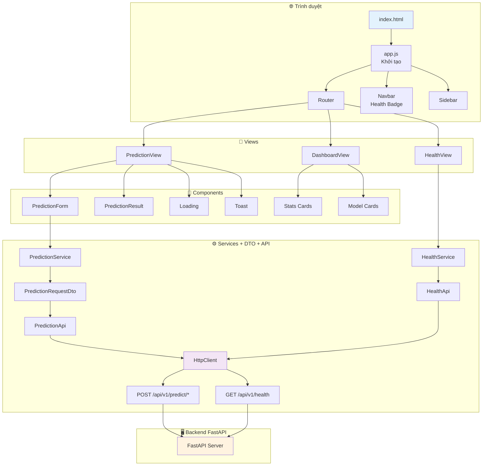
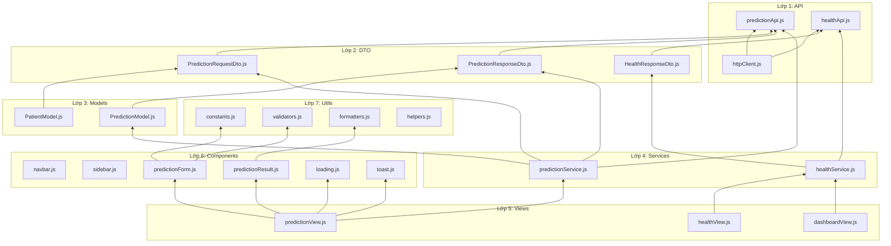
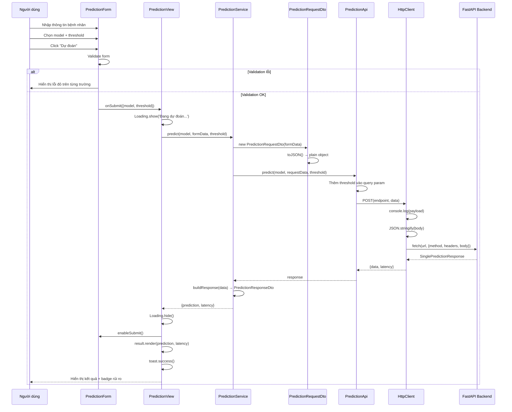

# 🏥 Hệ thống Dự đoán Tái nhập viện — Giao diện Web

> **Dashboard y tế hiện đại, real-time** cho phép bác sĩ và nhân viên y tế dự đoán nguy cơ tái nhập viện 30 ngày của bệnh nhân, sử dụng **Random Forest** và **XGBoost Ensemble**. Được xây dựng hoàn toàn bằng **HTML5, CSS3 và JavaScript thuần (ES6 Modules)** — không framework, không thư viện nặng.

[](https://developer.mozilla.org/en-US/docs/Web/JavaScript)
[](https://developer.mozilla.org/en-US/docs/Web/HTML)
[](https://developer.mozilla.org/en-US/docs/Web/CSS)
[](http://localhost:8000/docs)
[](LICENSE)

---

## 📸 Tổng quan giao diện

| Trang | Mô tả |
|-------|-------|
| **Tổng quan** | Thống kê hệ thống: trạng thái API, số model đã tải, uptime, độ trễ. Thẻ model, bắt đầu nhanh. |
| **Dự đoán** | Form nhập 24+ thông tin bệnh nhân, chọn model, cài ngưỡng, xem kết quả real-time. |
| **Sức khỏe hệ thống** | Giám sát real-time API health, danh sách model, response time, uptime. |

```
┌─────────────────────────────────────────────────┐
│  🏥 Hệ thống Dự đoán Tái nhập viện             │
│  ┌─────────┬──────────┬──────────┬────────────┐ │
│  │  API    │ Models   │ Uptime   │  Latency   │ │
│  │  Online │    2     │  1h 23m  │   45 ms    │ │
│  └─────────┴──────────┴──────────┴────────────┘ │
│  ┌───────────────────────────┬────────────────┐ │
│  │ 🌳 Random Forest         │ ⚡ XGBoost     │ │
│  │ ADASYN + GridSearchCV    │ Optuna + Calib │ │
│  └───────────────────────────┴────────────────┘ │
│  ┌────────────────────────────────────────────┐ │
│  │   Thông tin bệnh nhân                     │ │
│  │   [Giới tính] [Độ tuổi] [Chủng tộc]      │ │
│  │   [Loại nhập viện] [Ngày nằm viện] ...   │ │
│  │   ┌──────────────────────┐               │ │
│  │   │  🔮 Dự đoán          │               │ │
│  │   └──────────────────────┘               │ │
│  └────────────────────────────────────────────┘ │
└─────────────────────────────────────────────────┘
```

---

## 🚀 Tính năng

### 🧠 Dự đoán thông minh
- **Hai model AI** — Random Forest (ADASYN + GridSearchCV) và XGBoost Ensemble (Optuna + Isotonic Calibration)
- **Chọn model linh hoạt** — chuyển đổi giữa các model ngay trên giao diện
- **Ngưỡng phân loại tuỳ chỉnh** — preset 0.2 / 0.3 / 0.5 / 0.7 / 0.8 hoặc nhập tay
- **Kết quả trực quan** — badge NGUY CƠ CAO / THẤP, progress bar xác suất, thời gian xử lý
- **Badge rủi ro màu sắc** — đỏ cho nguy cơ cao, xanh cho nguy cơ thấp
- **Timestamp real-time** — thời gian dự đoán chính xác

### 📋 Form nhập liệu y tế
- **24+ trường dữ liệu** — nhân khẩu học, nhập viện, lâm sàng, thuốc, chẩn đoán ICD-9
- **Dropdown thông minh** — danh sách giá trị mapping sẵn (loại nhập viện, hình thức xuất viện, nguồn nhập viện)
- **Validation phía client** — kiểm tra bắt buộc, khoảng giá trị, định dạng ngay trước khi gửi
- **Placeholder hướng dẫn** — gợi ý nhập liệu cho từng trường

### 📊 Dashboard real-time
- **Thống kê tổng quan** — trạng thái API, số model, uptime, độ trễ
- **Thẻ model** — hiển thị thông tin chi tiết từng model
- **Bắt đầu nhanh** — 3 bước: Dự đoán → Kiểm tra → Xem kết quả
- **Sức khỏe hệ thống** — monitor real-time với nút Refresh

### 🔔 UX/UX cao cấp
- **Toast notification** — thông báo thành công / lỗi với animation trượt vào
- **Loading spinner** — overlay toàn màn hình khi đang xử lý
- **Disable nút submit** — ngăn gửi request trùng lặp
- **Empty state** — hiển thị thông báo thân thiện khi chưa có dữ liệu
- **Error state** — hiển thị lỗi chi tiết kèm hướng dẫn xử lý
- **Scroll vào kết quả** — tự động cuộn đến kết quả sau khi dự đoán

### 🎨 Giao diện chuyên nghiệp
- **Chủ đề y tế** — trung tính, sáng/tối, font chữ rõ ràng
- **Card-based layout** — bố cục thẻ khoa học
- **Responsive 100%** — tối ưu trên mobile, tablet, desktop
- **Animation mượt** — fade-in, slide-in, hover effects
- **CSS Variables** — dễ dàng tuỳ chỉnh theme, màu sắc

### 🔌 Tích hợp
- **Nút Swagger UI** — mở tài liệu API chỉ với 1 click
- **Health check tự động** — kiểm tra kết nối API mỗi 30 giây
- **Badge navbar** — hiển thị trạng thái API real-time

---

## 🏗️ Kiến trúc hệ thống

### Sơ đồ luồng dữ liệu



### Kiến trúc phân lớp (Layered Architecture)



### Luồng xử lý dự đoán chi tiết



---

## 🛠️ Công nghệ sử dụng

### Frontend

| Công nghệ | Mô tả |
|-----------|-------|
| **HTML5** | Cấu trúc semantic, responsive meta viewport |
| **CSS3** | Flexbox, Grid, CSS Variables, Animations, Media Queries |
| **JavaScript ES6** | Modules (import/export), Classes, Arrow functions, Async/Await, Fetch API |
| **Kiến trúc** | Layered Architecture (7 layers), SOLID principles |
| **Pattern** | DTO, Model, Service, View, Component, Router |

### CSS Components

| File | Mục đích |
|------|----------|
| `reset.css` | Reset mặc định trình duyệt |
| `variables.css` | 50+ design tokens (màu, khoảng cách, shadow, radius) |
| `layout.css` | Sidebar + Navbar + Main content grid |
| `components.css` | Card, Form, Button, Badge, Progress, Toast, Table, Modal |
| `app.css` | Page-specific styles, utility classes |

### Design Tokens (`variables.css`)

```css
--color-primary: #2563eb;       /* Xanh dương chủ đạo */
--color-success: #059669;       /* Xanh lá thành công */
--color-danger: #dc2626;        /* Đỏ nguy hiểm */
--color-warning: #d97706;       /* Vàng cảnh báo */
--color-sidebar: #1e293b;       /* Sidebar tối */
--color-bg: #f8fafc;            /* Nền sáng */
--shadow-md, --shadow-lg;       /* Đổ bóng */
--radius-md: 8px;               /* Bo góc */
--sidebar-width: 260px;         /* Chiều rộng sidebar */
--navbar-height: 64px;          /* Chiều cao navbar */
```

---

## 📂 Cấu trúc thư mục

```
ui/
│
├── index.html                         # 🚀 Điểm vào ứng dụng
├── README.md                          # 📘 Tài liệu dự án (file này)
│
├── assets/
│   ├── css/                           # 🎨 Stylesheets
│   │   ├── reset.css                  # Reset CSS, normalize
│   │   ├── variables.css              # Design tokens, CSS custom properties
│   │   ├── layout.css                 # Bố cục: sidebar, navbar, main
│   │   ├── components.css             # Component: card, form, button, badge, toast, table
│   │   └── app.css                    # Style trang cụ thể + utility classes
│   │
│   ├── js/                            # ⚡ JavaScript (ES6 Modules)
│   │   ├── app.js                     # Khởi tạo ứng dụng, health check loop
│   │   ├── config.js                  # Cấu hình API_BASE_URL
│   │   ├── router.js                  # Định tuyến client-side SPA
│   │   │
│   │   ├── api/                       # Lớp 1: Giao tiếp HTTP
│   │   │   ├── httpClient.js          # HTTP Client tổng quát (fetch, error handling, latency)
│   │   │   ├── predictionApi.js       # API endpoints dự đoán
│   │   │   └── healthApi.js           # API endpoint health check
│   │   │
│   │   ├── dto/                       # Lớp 2: Data Transfer Objects
│   │   │   ├── PredictionRequestDto.js    # Transform form → backend payload
│   │   │   ├── PredictionResponseDto.js   # Wrap response + computed properties
│   │   │   └── HealthResponseDto.js       # Wrap health response + getters
│   │   │
│   │   ├── models/                    # Lớp 3: Domain Models
│   │   │   ├── PatientModel.js        # Thực thể bệnh nhân
│   │   │   └── PredictionModel.js     # State management dự đoán
│   │   │
│   │   ├── services/                  # Lớp 4: Business Logic
│   │   │   ├── predictionService.js   # Orchestration dự đoán
│   │   │   └── healthService.js       # Orchestration health check
│   │   │
│   │   ├── views/                     # Lớp 5: Page Controllers
│   │   │   ├── dashboardView.js       # Trang tổng quan
│   │   │   ├── predictionView.js      # Trang dự đoán
│   │   │   └── healthView.js          # Trang sức khỏe hệ thống
│   │   │
│   │   ├── components/                # Lớp 6: UI Components
│   │   │   ├── navbar.js              # Thanh navbar + health badge
│   │   │   ├── sidebar.js             # Sidebar navigation
│   │   │   ├── predictionForm.js      # Form nhập liệu + validation
│   │   │   ├── predictionResult.js    # Kết quả dự đoán
│   │   │   ├── loading.js             # Loading overlay
│   │   │   └── toast.js               # Toast notification system
│   │   │
│   │   └── utils/                     # Lớp 7: Tiện ích
│   │       ├── validators.js          # Validation rules
│   │       ├── formatters.js          # Format: probability, risk, model name
│   │       ├── constants.js           # Constants: enums, options, paths
│   │       └── helpers.js             # DOM helpers, sanitize, debounce
│   │
│   └── images/                        # 🖼️ Tài nguyên hình ảnh
│
└── docs/                              # 📚 Tài liệu
    ├── ui-architecture.md             # Kiến trúc chi tiết
    ├── api-integration.md             # Hướng dẫn tích hợp API
    └── folder-structure.md            # Cấu trúc thư mục
```

---

## ⚡ Cài đặt

### Yêu cầu

- **Backend**: FastAPI server đang chạy tại `http://localhost:8000` (xem hướng dẫn ở `../README.md`)
- **Trình duyệt**: Chrome 90+, Firefox 90+, Edge 90+, Safari 15+
- **HTTP Server** (tuỳ chọn): Python 3, Node.js, hoặc VS Code Live Server

### Bước 1: Kiểm tra backend

```bash
# Đảm bảo API đang chạy
curl http://localhost:8000/api/v1/health

# Kết quả mong đợi:
# {"status":"healthy","version":"1.0.0","models_loaded":2,...}
```

### Bước 2: Phục vụ frontend

Chọn **1 trong 3** cách sau:

```bash
# Cách 1: Python (khuyến nghị)
cd patient-readmission-prediction-core
python -m http.server 5500 -d ui

# Cách 2: VS Code Live Server
# Mở ui/index.html → chuột phải → "Open with Live Server"

# Cách 3: Node.js
npx serve ui -p 5500
```

### Bước 3: Mở trình duyệt

```
http://localhost:5500
```

Frontend sẽ tự động kết nối đến `http://localhost:8000`.

---

## 🔧 Cấu hình

Tập tin **`assets/js/config.js`**:

```js
export const CONFIG = {
  API_BASE_URL: 'http://localhost:8000',   // Địa chỉ backend API
  APP_NAME: 'Patient Readmission Prediction System',
  APP_VERSION: '1.0.0',
};
```

### Biến môi trường

| Biến | Giá trị mặc định | Mô tả |
|------|-----------------|-------|
| `API_BASE_URL` | `http://localhost:8000` | URL backend FastAPI |

> **Lưu ý**: Nếu backend chạy ở port khác (ví dụ 8080), cập nhật `API_BASE_URL` tương ứng.

---

## 🏛️ Kiến trúc chi tiết

### Nguyên lý SOLID

| Nguyên lý | Áp dụng |
|-----------|---------|
| **S** — Single Responsibility | Mỗi lớp (API, DTO, Model, Service, View, Component) có 1 trách nhiệm duy nhất |
| **O** — Open/Closed | Thêm model mới → thêm API endpoint mới, không sửa code cũ |
| **L** — Liskov Substitution | Các View đều kế thừa cùng interface `render()` |
| **I** — Interface Segregation | Component chỉ expose đúng method cần thiết |
| **D** — Dependency Inversion | View phụ thuộc vào Service (abstract), không phụ thuộc vào API cụ thể |

### Luồng dữ liệu

```
👤 Tương tác người dùng
    ↓
🧩 Component Layer (form, nút bấm)
    ↓
📄 View Layer (điều phối)
    ↓
⚙️ Service Layer (logic nghiệp vụ)
    ↓
📦 DTO Layer (chuyển đổi dữ liệu)
    ↓
🌐 API Layer (giao tiếp HTTP)
    ↓
🖥️ Backend API (FastAPI)
```

### Xử lý lỗi

| Layer | Cơ chế | Hiển thị |
|-------|--------|----------|
| **API Layer** | `HttpClientError` với status, latency | — |
| **Service Layer** | Bắt lỗi, cập nhật model state | — |
| **View Layer** | `toast.error()`, `result.showError()` | 🔴 Toast đỏ + card lỗi |
| **Network** | `fetch` fail → `HttpClientError` | 🔴 "Không thể kết nối máy chủ" |
| **Validation** | `Validators` class → error object | 🔴 Đỏ border + message dưới field |

---

## 🔌 Tích hợp API

### Endpoints

| Method | Endpoint | Mô tả | Dùng bởi |
|--------|----------|-------|----------|
| `POST` | `/api/v1/predict/random-forest` | Dự đoán Random Forest | Form dự đoán |
| `POST` | `/api/v1/predict/xgboost` | Dự đoán XGBoost Ensemble | Form dự đoán |
| `GET` | `/api/v1/health` | Kiểm tra sức khoẻ | Dashboard, Navbar, Health page |
| `GET` | `/docs` | Swagger UI | Nút "Tài liệu API" trên navbar |

### Ví dụ request

```javascript
// Frontend tự động gửi:
POST http://localhost:8000/api/v1/predict/random-forest?threshold=0.2
Content-Type: application/json

{
  "race": "Caucasian",
  "gender": "Male",
  "age": "[70-80)",
  "admission_type_id": 1,
  "discharge_disposition_id": 1,
  "admission_source_id": 7,
  "time_in_hospital": 5,
  "payer_code": "MC",
  "medical_specialty": "Cardiology",
  "num_lab_procedures": 41,
  "num_procedures": 0,
  "num_medications": 16,
  "number_outpatient": 0,
  "number_emergency": 0,
  "number_inpatient": 1,
  "number_diagnoses": 5,
  "max_glu_serum": "None",
  "A1Cresult": ">7",
  "metformin": "Steady",
  "repaglinide": "No",
  // ... (23 drug fields + change, diabetesMed, diag_1/2/3)
}
```

### Ví dụ response

```json
{
  "prediction": 1,
  "probability": 0.8734,
  "model_name": "Random Forest",
  "model_version": "1.0",
  "threshold": 0.2,
  "timestamp": "2026-05-27T14:00:00.123456+00:00",
  "status": "success",
  "processing_time_ms": 45.23
}
```

### Schema đầy đủ

Xem tài liệu chi tiết tại:
- **Swagger UI**: [`http://localhost:8000/docs`](http://localhost:8000/docs)
- **ReDoc**: [`http://localhost:8000/redoc`](http://localhost:8000/redoc)
- **File docs**: [`docs/api-integration.md`](docs/api-integration.md)

---

## 🧪 Kiểm thử

### Mở Swagger UI

Click nút 🔗 **Tài liệu API** trên navbar → mở Swagger UI tại `http://localhost:8000/docs`.

### Debug console

Mở DevTools (F12) → Console để xem log:

```
Prediction payload: {race: 'Asian', gender: 'Male', age: '[20-30)', ...}
Payload type: object
```

### Test bằng cURL

```bash
# Kiểm tra health
curl http://localhost:8000/api/v1/health

# Test Random Forest
curl -X POST "http://localhost:8000/api/v1/predict/random-forest?threshold=0.2" \
  -H "Content-Type: application/json" \
  -d '{
    "gender": "Male",
    "age": "[60-70)",
    "admission_type_id": 1,
    "discharge_disposition_id": 1,
    "admission_source_id": 7,
    "time_in_hospital": 5,
    "num_lab_procedures": 41,
    "num_procedures": 0,
    "num_medications": 16,
    "number_outpatient": 0,
    "number_emergency": 0,
    "number_inpatient": 1,
    "number_diagnoses": 5,
    "max_glu_serum": "None",
    "A1Cresult": "None",
    "metformin": "No",
    "insulin": "No",
    "change": "No",
    "diabetesMed": "No"
  }'
```

---

## ❓ Xử lý sự cố

### Frontend không kết nối được API

```
Lỗi: Không thể kết nối máy chủ
```

✅ **Kiểm tra**:
1. Backend đã chạy? `uvicorn app.main:app --host 0.0.0.0 --port 8000`
2. Đúng URL? Mở `http://localhost:8000/api/v1/health` trên trình duyệt
3. CORS? Backend mặc định cho phép `*` — kiểm tra file `.env`

### Lỗi CORS

```
Lỗi: Access to fetch at '...' from origin '...' has been blocked by CORS policy
```

✅ **Fix**: Mở `app/core/config.py`, đảm bảo `cors_origins = ["*"]` hoặc thêm origin của bạn.

### Form không submit

✅ **Kiểm tra**:
1. Console (F12) có lỗi JS không?
2. Các trường bắt buộc (có dấu `*`) đã điền đủ?
3. Threshold nhập tay có trong khoảng 0–1?

### Kết quả dự đoán không hiển thị

✅ **Kiểm tra**:
1. Backend trả về status 200? (Xem Network tab)
2. Response có đúng định dạng? (JSON với `prediction`, `probability`, ...)
3. Popup blocker không chặn?

### Trang trắng (White screen)

✅ **Nguyên nhân**:
1. File `index.html` không tìm thấy CSS/JS — dùng HTTP server, không mở trực tiếp file://
2. Lỗi ES6 module — cần trình duyệt hiện đại
3. Cache cũ — Ctrl + Shift + R (hard reload)

### Lỗi validation form

```
Số ngày nằm viện phải từ 1 đến 30
```

✅ **Fix**: Nhập giá trị trong khoảng cho phép (xem hint dưới mỗi field).

---

## 📚 Tài liệu

| File | Nội dung |
|------|----------|
| [`docs/ui-architecture.md`](docs/ui-architecture.md) | Kiến trúc UI chi tiết, các layer, luồng dữ liệu |
| [`docs/api-integration.md`](docs/api-integration.md) | Tích hợp API, endpoints, request/response mẫu |
| [`docs/folder-structure.md`](docs/folder-structure.md) | Cấu trúc thư mục và chức năng từng file |

---

## 🗺️ Lộ trình phát triển

- [ ] **Dark mode** — chuyển đổi chủ đề sáng/tối
- [ ] **Batch prediction UI** — upload file CSV hoặc nhập nhiều bệnh nhân
- [ ] **Biểu đồ thống kê** — Chart.js hoặc canvas native
- [ ] **Lịch sử dự đoán** — localStorage IndexedDB
- [ ] **Export PDF/CSV** — xuất báo cáo kết quả
- [ ] **Multi-language** — chuyển đổi EN / VI
- [ ] **PWA** — Progressive Web App, offline support
- [ ] **Unit test** — Jest hoặc native test framework

---

## 🤝 Đóng góp

1. Fork dự án
2. Tạo branch tính năng: `git checkout -b feature/awesome-feature`
3. Commit: `git commit -m 'Thêm tính năng XYZ'`
4. Push: `git push origin feature/awesome-feature`
5. Tạo Pull Request

---

## 📄 Giấy phép

MIT License — xem file [LICENSE](../LICENSE) (nếu có).

---

## 👨‍💻 Tác giả

Dự án được phát triển bởi nhóm **Patient Readmission Prediction**.

- **Backend**: FastAPI + Python ML
- **Frontend**: Vanilla JS (ES6 Modules)
- **Dataset**: Diabetes 130-US Hospitals (UCI ML Repository)
